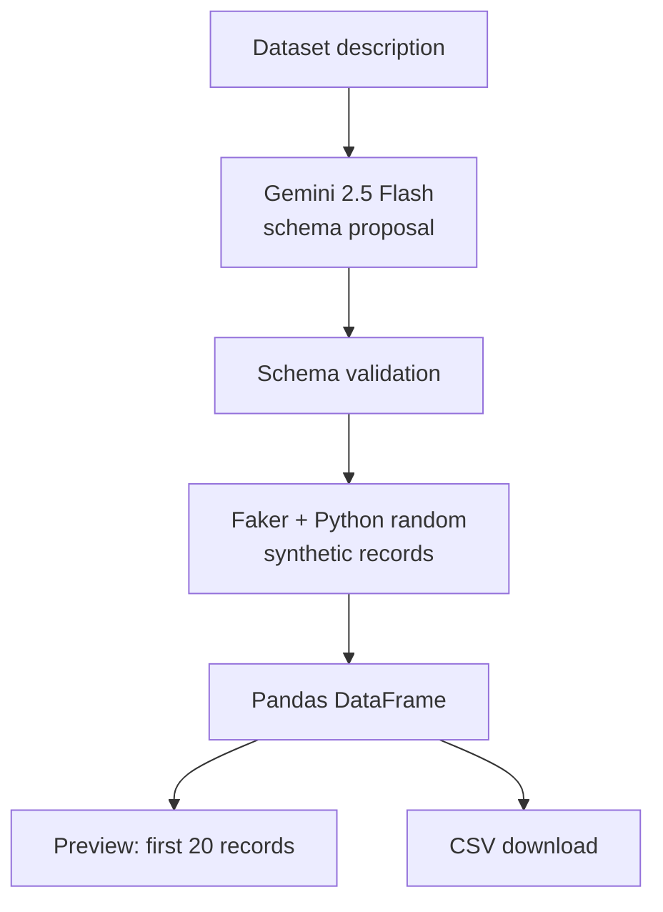
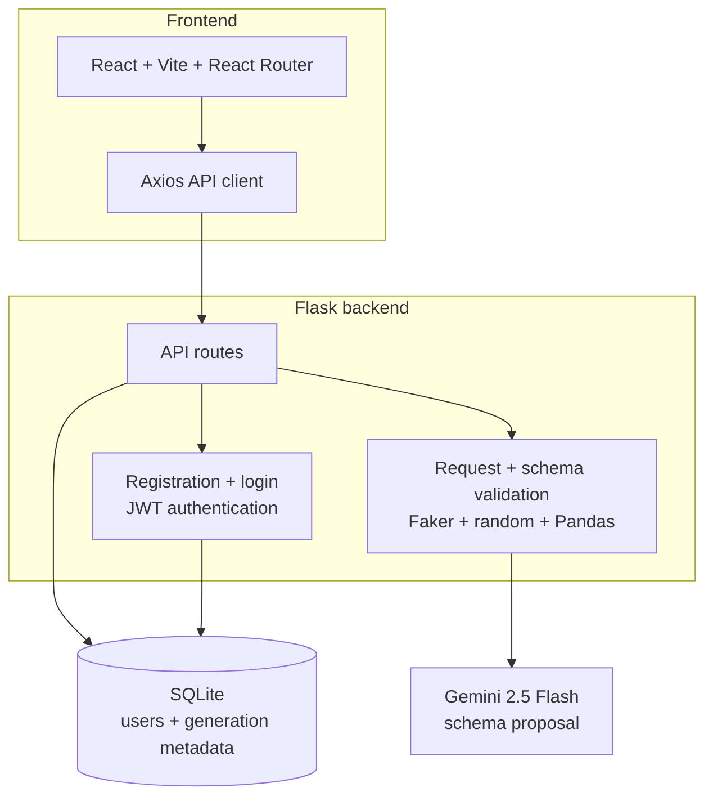

<div align="center">

# SynthGEN

**Generate structured synthetic tabular datasets from plain-language descriptions.**

SynthGEN is a full-stack application that uses Google Gemini to interpret a dataset request and propose a structured schema, then generates synthetic records locally with Faker, Python utilities, and Pandas.

**React · Flask · Gemini · Faker · Pandas · SQLite**

[](https://github.com/manthan3502/SynthGEN/actions/workflows/ci.yml) [](LICENSE)   

</div>

---

## Status

SynthGEN is built for local use, prototyping, and experimentation.

- Backend API, authentication, dataset generation, history, and settings are implemented.
- Automated backend tests are included.
- Frontend lint and production build are verified in GitHub Actions.
- Local setup is documented below; no permanent live demo is advertised.

---

## The Problem

Developers and analysts often need structured sample data for prototyping, testing, demonstrations, and interface development.

Creating those datasets manually can be repetitive, especially when the required schema changes from one use case to another.

SynthGEN lets a user describe the required dataset in plain language, for example:

```text
Create a customer dataset with name, age, city, email,
subscription type and monthly spending.
```

The application interprets the request, generates a compatible schema, creates synthetic records, and lets the user preview or download the result as CSV.

---

## What SynthGEN Does

| Capability | Description |
|---|---|
| Plain-language dataset requests | Describe the dataset you need instead of manually defining every column |
| AI-assisted schema generation | Gemini proposes column names, types, numeric ranges and choice values |
| Synthetic record generation | Faker and Python utilities generate values from the validated schema |
| Dataset preview | Preview the first 20 generated records in the application |
| CSV export | Generate and download datasets as CSV |
| Authentication | Register and sign in using JWT-based authentication |
| Generation history | View and delete your own previous generation records |
| Account settings | Update account name and email |
| Input validation | Dataset requests and provider-generated schemas are validated before use |

A single request can generate up to **5,000 rows**.

---

## How Generation Works

SynthGEN separates **schema interpretation** from **record generation**.



Gemini proposes the schema; Faker and Python utilities generate the rows.

The preview and CSV endpoints each run this pipeline independently. Downloading a
CSV generates a new dataset, so its records may differ from the preview.

---

## System Architecture



SQLite stores:

- registered users
- generation prompts
- row counts
- column counts
- generated filenames
- generation timestamps

Generated datasets themselves are **not persisted** in SQLite.

---

## Engineering Decisions

| Decision | Reason |
|---|---|
| Gemini is used for schema interpretation only | Separates language interpretation from local synthetic record generation |
| Provider output is validated before use | AI-generated schemas are treated as untrusted input |
| Faker generates domain-style values | Provides names, addresses, companies, emails, dates and other synthetic values without requiring the model to generate each row |
| Pandas builds the dataset | Provides a simple tabular representation and reliable CSV generation |
| Only generation metadata is persisted | Keeps the database lightweight and avoids storing potentially large generated datasets |
| History is scoped to the authenticated user | Users can only access and delete their own generation records |
| CORS uses explicit allowed origins | Avoids unrestricted cross-origin API access |
| Backend secrets stay outside the frontend | Gemini credentials and signing secrets are server-side environment variables |
| CSV values are sanitized | Formula-like strings are escaped before spreadsheet download |
| Provider errors are sanitized | Internal provider messages are not returned directly to clients |

---

## Technology Stack

| Layer | Technology |
|---|---|
| Frontend | React 19, Vite, React Router, Axios |
| Backend | Python 3.12, Flask |
| Authentication | Flask-JWT-Extended, Werkzeug password hashing |
| ORM | Flask-SQLAlchemy |
| Database | SQLite |
| AI | Google Gemini API |
| Synthetic data | Faker, Python random |
| Data processing | Pandas |
| Configuration | python-dotenv |
| Backend testing | pytest |
| Frontend quality | ESLint, Vite production build |
| CI | GitHub Actions |
| License | MIT |

---

## Repository Structure

```text
SynthGEN/
├── .github/
│   └── workflows/
│       └── ci.yml
├── backend/
│   ├── tests/
│   │   ├── conftest.py
│   │   ├── test_api.py
│   │   └── test_generator.py
│   ├── .env.example
│   ├── app.py
│   ├── auth.py
│   ├── database.py
│   ├── generator.py
│   ├── pytest.ini
│   ├── requirements-dev.txt
│   ├── requirements-lock.txt
│   └── requirements.txt
├── frontend/
│   ├── public/
│   │   ├── favicon.svg
│   │   └── icons.svg
│   ├── src/
│   │   ├── assets/
│   │   │   └── hero.png
│   │   ├── components/
│   │   │   ├── ProtectedRoute.jsx
│   │   │   └── Sidebar.jsx
│   │   ├── pages/
│   │   │   ├── Generate.jsx
│   │   │   ├── History.jsx
│   │   │   ├── Landing.jsx
│   │   │   ├── Login.jsx
│   │   │   ├── Register.jsx
│   │   │   └── Settings.jsx
│   │   ├── utils/
│   │   │   └── api.js
│   │   ├── App.jsx
│   │   ├── index.css
│   │   └── main.jsx
│   ├── .env.example
│   ├── .gitignore
│   ├── eslint.config.js
│   ├── index.html
│   ├── package-lock.json
│   ├── package.json
│   ├── README.md
│   └── vite.config.js
├── .gitignore
├── LICENSE
└── README.md
```

---

## Run Locally

### Prerequisites

- Git
- Python 3.12
- Node.js 24 LTS with npm (the version used in CI)
- Google Gemini API key for live dataset generation

Clone the repository:

```bash
git clone https://github.com/manthan3502/SynthGEN.git
cd SynthGEN
```

---

### Backend Setup

Create a virtual environment:

```bash
python -m venv .venv
```

On Windows PowerShell:

```powershell
.\.venv\Scripts\Activate.ps1
```

On macOS/Linux:

```bash
source .venv/bin/activate
```

Install dependencies:

```bash
python -m pip install -r backend/requirements-lock.txt -r backend/requirements-dev.txt
python -m pip check
```

`requirements.txt` pins direct runtime dependencies; `requirements-lock.txt` pins
the resolved runtime dependency graph. `requirements-dev.txt` adds pytest.

Create the backend environment file.

Windows PowerShell:

```powershell
Copy-Item backend/.env.example backend/.env
```

macOS/Linux:

```bash
cp backend/.env.example backend/.env
```

Configure:

```env
GEMINI_API_KEY=
SECRET_KEY=
```

`SECRET_KEY` must contain a random value of at least 32 characters. Configure
these values privately; never commit credentials. Automated tests do not need a
real Gemini key. Existing process environment variables take precedence over the
backend environment file.

Start the backend:

```bash
cd backend
python app.py
```

On startup, the backend creates SQLite tables in the ignored
`backend/instance/dataforge.db` file. The API runs locally at:

```text
http://localhost:5000
```

---

### Frontend Setup

Open another terminal **at the repository root**:

```bash
cd frontend
npm ci
```

Create the frontend environment file.

Windows PowerShell:

```powershell
Copy-Item .env.example .env
```

macOS/Linux:

```bash
cp .env.example .env
```

The default configuration is:

```env
VITE_API_BASE_URL=http://localhost:5000
```

Start the development server:

```bash
npm run dev
```

The frontend normally runs at:

```text
http://localhost:5173
```

---

## Environment Variables

### Backend

| Variable | Purpose |
|---|---|
| `GEMINI_API_KEY` | Required for live Gemini schema generation |
| `SECRET_KEY` | Used for backend/JWT signing; minimum 32 characters |
| `CORS_ORIGINS` | Comma-separated allowed frontend origins |

Default development CORS origins:

```text
http://localhost:5173
http://127.0.0.1:5173
```

If Vite chooses a different port, add that origin to `CORS_ORIGINS`. The frontend
API URL defaults to `http://localhost:5000` when `VITE_API_BASE_URL` is unset.

### Frontend

| Variable | Purpose |
|---|---|
| `VITE_API_BASE_URL` | Public URL used by the frontend to reach the Flask API |

Frontend environment variables are part of the browser bundle and must not contain backend secrets.

---

## Testing and Verification

The repository includes automated backend tests and CI validation for both application layers.

| Check | Command |
|---|---|
| Backend tests | `python -m pytest -c backend/pytest.ini backend/tests -q` |
| Backend dependency consistency | `python -m pip check` |
| Frontend lockfile installation | `npm ci` (in `frontend/`) |
| Frontend lint | `npm run lint` (in `frontend/`) |
| Frontend build | `npm run build` (in `frontend/`) |

The [CI workflow](.github/workflows/ci.yml) runs dependency installation, backend
tests and dependency checks, and frontend lint/build on pushes to `main` and pull
requests. It uses read-only repository permissions and requires no Gemini secret.

Run the backend test suite from the repository root:

```bash
python -m pytest -c backend/pytest.ini backend/tests -q
```

Backend tests use:

- temporary SQLite databases
- test-only signing credentials
- mocked schema generation
- blocked external network calls

The automated suite covers areas including:

- registration
- login
- protected routes
- input validation
- dataset generation
- CSV export
- generation history
- history ownership
- deletion
- CORS configuration
- unsafe schema handling
- provider error privacy

Frontend verification:

```bash
cd frontend
npm ci
npm run lint
npm run build
```

The repository currently does not contain a frontend automated test suite.

Live Gemini requests are intentionally excluded from automated CI.

---

## Security and Privacy

The existing implementation includes these safeguards:

- Passwords are stored using Werkzeug password hashing.
- Protected API routes require JWT authentication.
- User generation history is scoped to the authenticated account.
- Backend signing secrets are required through environment configuration.
- Gemini API credentials remain backend-only.
- CORS requires explicit allowed origins.
- Provider error details are not returned directly to users.
- CSV values beginning with spreadsheet-formula characters are escaped before download.
- `.env` files, SQLite databases, Python caches, build output and local virtual environments are excluded from Git.

Users should avoid entering confidential information in dataset descriptions because prompts are sent to Gemini and generation descriptions are stored in local history.

---

## Deployment Status

SynthGEN is currently intended to run locally.

The repository does not provide a guaranteed public deployment or permanent live
demo. The setup instructions target local development.

The Flask development server included in the project should not be treated as a production hosting configuration.

---

## Known Limitations

- Generated data is synthetic and should not be treated as real-world measured data.
- Columns are generated independently, so complex real-world relationships between fields may not be preserved.
- CSV downloads perform a new generation request and may therefore differ from the dataset shown in the earlier preview.
- Generated datasets are not persisted; only generation metadata is stored.
- JSON is used for API communication, but JSON **file export** is not implemented.
- The Gemini integration uses the legacy, unsupported `google-generativeai` SDK
  and requests `gemini-2.5-flash`. Live generation depends on provider availability,
  account quota, and pricing; the repository does not guarantee free API usage.
- Authentication does not currently include email verification, password reset, rate limiting or token revocation.
- JWTs are stored in browser local storage.
- Dataset generation does not use a fixed random seed, so identical prompts are not guaranteed to produce identical records.

---

## Possible Extensions

Future versions could include:

- persistent generated datasets so downloads exactly match previews
- seeded generation for reproducible datasets
- additional export formats such as JSON
- stronger authentication and production security controls
- migration to a maintained Gemini SDK

These are possible extensions, not current features.

---

## License

This project is licensed under the [MIT License](LICENSE).

---

## Author

**Manthan Karekar**
